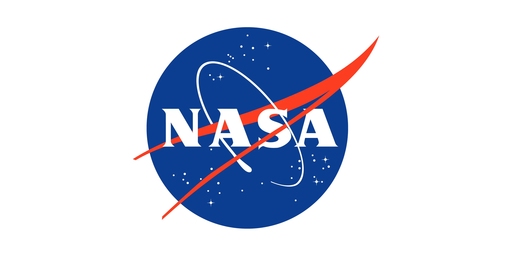
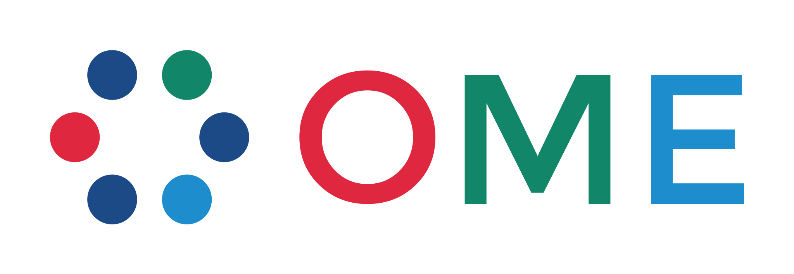
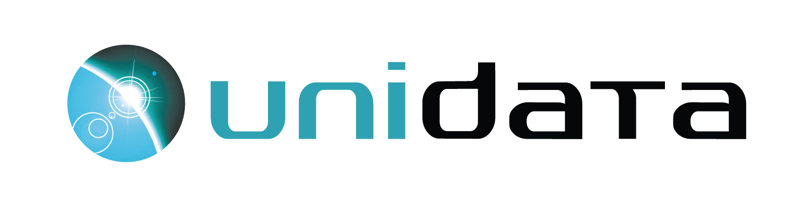

💡 Se você estiver usando Zarr de alguma forma e quiser ser adicionado a esta página, por favor, ponha o logotipo e o resumo <a href="https://github.com/zarr-developers/community/issues/60">aqui</a>.

 Obrigado à incrível comunidade, Zarr é amplamente adotado e usado por esses grupos. Aqui estão os logotipos (em ordem alfabética):

→ Zarr é usado por <a href="https://carbonplan.org/">CarbonPlan</a> como um formato de armazenamento para análise e visualização dos dados climáticos.

---

---

---

→ O Zarr é atualmente usado pela DANDI para microscopia de lâmina de luz e alguns conjuntos de dados de ressonância magnética ex vivo, e está sendo considerado um backend para conjuntos de dados de neurofisiologia da Neurodata Without Borders (NWB).

---

→ Google Research lançou uma série de projetos de código aberto para trabalhar com dados de Zarr (incluindo <a href="https://github.com/google/neuroglancer/">Neuroglancer</a>, <a href="https://github.com/google/tensorstore/">TensorStore</a>, <a href="https://github.com/google/xarray-beam/">Xarray-Beam</a> e <a href="https://github.com/google/xarray-tensorstore/">Xarray-TensorStore</a>) e usa Zarr para distribuir <a href="https://github.com/google-research/arco-era5/">conjuntos de dados meteorológicos em larga escala</a>.

---

→ Zarr é usado extensivamente dentro do Janelia Research Campus, para armazenar e acessar com eficiência grandes conjuntos de dados de imagens

---

→ Zarr é usado pelo <a href="https://leap.columbia.edu/">LEAP Project</a> (Learning the Earth with Artificial Intelligence and Physics) na Universidade Columbia como formato de dados para a biblioteca de dados LEAP-Pangeo. Pesquisadores de LEAP usam Zarr para realizar análise de dados e aprendizado de máquina para modelagem climática.

---

→ Zarr é usado pelo <a href="https://planetarycomputer.microsoft.com/">Microsoft Planetary Computer</a> como um formato de armazenamento nativo em nuvem para conjuntos de dados geoespaciais.

---

→ O Zarr é usado pela NASA como um armazenamento de dados pronto para análise de matrizes N-dimensionais de dados geoespaciais.

---

---

→ A comunidade <a href="https://www.openmicroscopy.org/">Open Microscopy Environment (OME)</a> está desenvolvendo um formato, OME-Zarr, usando Zarr para armazenar grandes imagens biológicas n-dimensionais como parte do esforço de <a href="https://ngff.openmicroscopy.org/">formato de arquivo de nova geração (NGFF)</a>."

Logotipo OME usado com <a href="https://www.openmicroscopy.org/artwork/">permissão</a>, marca registrada da <a href="https://www.glencoesoftware.com/">Glencoe Software, Inc.</a>

---

→ Zarr é usado extensivamente dentro do projeto <a href="https://pangeo.io/">Pangeo</a> como um formato de armazenamento nativo de nuvem para o oceano, meteorologia, clima e dados geoespaciais.

---

→ mentes escaláveis usam Zarr para armazenar e processar imagens peta-escala 3D de tecido cerebrais para análises de conectômicas.

---

→ <a href="https://www.unidata.ucar.edu/">Unidata</a> está desenvolvendo suas bibliotecas netCDF para apoiar os dados do Zarr entre a comunidade atmosférica e geoscientífica.

---

→ WEBKNOSSOS é uma plataforma baseada na web para visualizar, anotar e compartilhar imagens grandes em 3D. Zarr é usado para acessar imagens remotamente armazenadas, bem como para transmitir dados de anotação de dados a aplicações do cliente.

---
