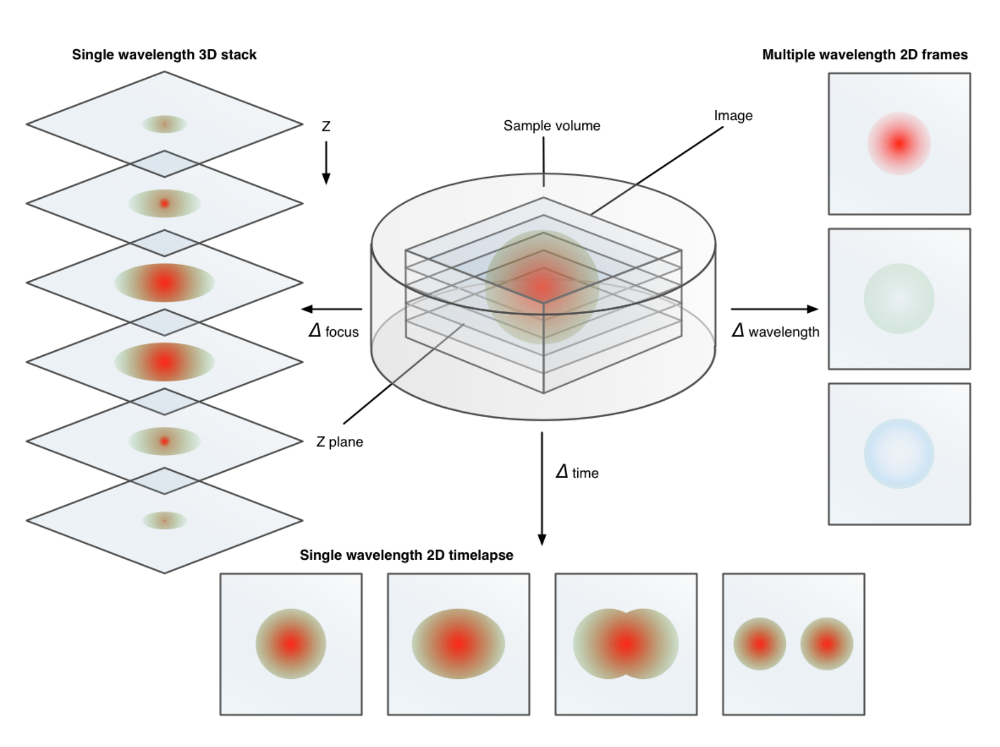

Zarr - scalable storage of tensor data for parallel and distributed computing
-----------------------------------------------------------------------------

<p class="stretch"></p>

Alistair Miles ([@alimanfoo](https://github.com/alimanfoo)) - SciPy 2019

<small>These slides: https://zarr-developers.github.io/slides/scipy-2019.html</small>

====

<p class="stretch"></p>

====

## Motivation: Why Zarr?

===

### Problem statement

<p class="stretch"></p>

There is some computation we want to perform. 

Inputs and outputs are multidimensional arrays (a.k.a. tensors).

5 key features...

===

### (1) Larger than memory

Input and/or output tensors are too big to fit comfortably in main
memory.

===

### (2) Computation can be parallelised

<p class="stretch"></p>

At least some part of the computation can be parallelised by
processing data in chunks.

===

### E.g., embarassingly parallel

<p class="stretch"></p>

===

### (3) I/O is the bottleneck

Computational complexity is moderate &rarr; significant amount of time is
spent in reading and/or writing data.

N.B., bottleneck may be due to (a) limited I/O bandwidth, (b) I/O is
not parallel.

===

### (4) Data are compressible

* Compression is a very active area of innovation. 
* Modern compressors achieve good compression ratios with very high speed.
* Compression can increase effective I/O bandwidth, sometimes
  dramatically.

===

### (5) Speed matters

* Rich datasets &rarr; exploratory science &rarr; interactive analysis
  &rarr; many rounds of summarise, visualise, hypothesise, model,
  test, repeat.

* E.g., genome sequencing.

  * Now feasible to sequence genomes from 100,000s of individuals and
    compare them.

  * Each genome is a complete molecular blueprint for an organism
    &rarr; can investigate many different molecular pathways and
    processes.
  
  * Each genome is a history book handed down through the ages, with
    each generation making its mark &rarr; can look back in time and
    infer major demographic and evolutionary events in the history of
    populations and species.

===

### Problem: key features

0. Inputs and outputs are tensors.
1. Data are larger than memory.
2. Computation can be parallelised.
3. I/O is the bottleneck.
4. Data are compressible.
5. Speed matters.

====

## Solution

1. Chunked, parallel tensor computing framework.
2. Chunked, parallel tensor storage library. 

Align the chunks!

===

<p></p>

Parallel computing framework for chunked tensors.

```python
import dask.array as da

a = ...  # what goes here?
x = da.from_array(a)
y = (x - x.mean(axis=1)) / x.std(axis=1)
u, s, v = da.linalg.svd_compressed(y, 20)
u = u.compute()
```

* Write code using a numpy-like API.
* Parallel execution on local workstation, HPC cluster, Kubernetes cluster, ...

===

<p class="stretch"></p>

* Scale up ocean / atmosphere / land / climate science.
* Aim to handle petabyte-scale datasets on HPC and cloud platforms.
* Using Dask.
* Needed a tensor storage solution.
* Interested to use cloud object stores: Amazon S3, Azure Blob Storage, Google Cloud Storage, ...

====

## Tensor storage: prior art

===

### HDF5 (h5py)

* Store tensors ("datasets").
* Divide data into regular chunks.
* Chunks are compressed.
* Group tensors into a hierarchy.
* Smooth integration with NumPy...

```python
import h5py
x = h5py.File('example.h5')['x']
# read 1000 rows into numpy array
y = x[:1000]
```

===

### HDF5 - limitations

* No thread-based parallelism.
* Cannot do parallel writes with compression.
* Not easy to plug in a new compressor.
* No support for cloud object stores (but see [Kita](https://www.hdfgroup.org/solutions/hdf-kita/hdf-kita-architecture)).

See also [moving away from
HDF5](https://cyrille.rossant.net/moving-away-hdf5/) by Cyrille Rossant.

===

### bcolz

<p class="stretch"></p>

* Developed by [Francesc Alted](https://github.com/FrancescAlted).
* Chunked storage, primarily intended for storing 1D arrays (table columns), but can also store tensors.
* Implementation is simple (in a good way).
* Data format on disk is simple - one file for metadata, one file for each chunk.
* Showcase for the [Blosc compressor](http://blosc.org/).

===

### bcolz - limitations

* Chunking in 1 dimension only.
* No support for cloud object stores.

====

## How hard could it be ...

... to implement a chunked storage library for tensor data that
supported parallel reads, parallel writes, was easy to plug in new
compressors, and easy to plug in different storage systems like cloud
object stores?

===

### ```<montage/>```

<p class="stretch">3 years, 1,107 commits, 39 releases, 259 issues, 165 PRs, and at least 2 babies later ...</p>

====

### Zarr Python

```bash
$ pip install zarr
```

```bash
$ conda install -c conda-forge zarr
```

```python
>>> import zarr
>>> zarr.__version__
'2.3.2'
```

===

### Conceptual model based on HDF5

* Multiple arrays (a.k.a. datasets) can be created and organised into
  a hierarchy of groups.
  
* Each array is divided into regular shaped chunks.

* Each chunk is compressed before storage.

===

### Creating a hierarchy

```python
>>> store = zarr.DirectoryStore('example.zarr')
>>> root = zarr.group(store)
>>> root
<zarr.hierarchy.Group '/'>
```

Using DirectoryStore the data will be stored in a directory on the
local file system.

===

### Creating an array

```python
>>> hello = root.zeros('hello', 
...                    shape=(10000, 10000), 
...                    chunks=(1000, 1000), 
...                    dtype='<i4')
>>> hello
<zarr.core.Array '/hello' (10000, 10000) int32>
```

* Creates a 2-dimensional array of 32-bit integers with 10,000 rows
and 10,000 columns.

* Divided into chunks where each chunk has 1,000 rows and 1,000 columns.

* There will be 100 chunks in total, arranged in a 10x10 grid.

===

### Creating an array (h5py-style API)

```python
>>> hello = root.create_dataset('hello', 
...                             shape=(10000, 10000), 
...                             chunks=(1000, 1000), 
...                             dtype='<i4')
>>> hello
<zarr.core.Array '/hello' (10000, 10000) int32>
```

===

### Creating an array (big)

```python
>>> big = root.zeros('big',
...                  shape=(100_000_000, 100_000_000),
...                  chunks=(10_000, 10_000),
...                  dtype='i4')
>>> big
<zarr.core.Array '/big' (100000000, 100000000) int32>
```

===

### Creating an array (big)

```python
>>> big.info
Name               : /big
Type               : zarr.core.Array
Data type          : int32
Shape              : (100000000, 100000000)
Chunk shape        : (10000, 10000)
Order              : C
Read-only          : False
Compressor         : Blosc(cname='lz4', clevel=5, shuffle=SHUFFLE, blocksize=0)
Store type         : zarr.storage.DirectoryStore
No. bytes          : 40000000000000000 (35.5P)
No. bytes stored   : 355
Storage ratio      : 112676056338028.2
Chunks initialized : 0/100000000
```

* That's a 35 petabyte array.
* N.B., chunks are initialized on write.

===

### Writing data into an array

```python
>>> big[0, 0:20000] = np.arange(20000)
>>> big[0:20000, 0] = np.arange(20000)
```

* Same API as writing into numpy array or h5py dataset.

===

### Reading data from an array

```python
>>> big[0:1000, 0:1000]
array([[  0,   1,   2, ..., 997, 998, 999],
       [  1,   0,   0, ...,   0,   0,   0],
       [  2,   0,   0, ...,   0,   0,   0],
       ...,
       [997,   0,   0, ...,   0,   0,   0],
       [998,   0,   0, ...,   0,   0,   0],
       [999,   0,   0, ...,   0,   0,   0]], dtype=int32)
```

* Same API as slicing a numpy array or reading from an h5py dataset.

===

### Chunks are initialized on write

```python
>>> big.info
Name               : /big
Type               : zarr.core.Array
Data type          : int32
Shape              : (100000000, 100000000)
Chunk shape        : (10000, 10000)
Order              : C
Read-only          : False
Compressor         : Blosc(cname='lz4', clevel=5, shuffle=SHUFFLE, blocksize=0)
Store type         : zarr.storage.DirectoryStore
No. bytes          : 40000000000000000 (35.5P)
No. bytes stored   : 5171386 (4.9M)
Storage ratio      : 7734870303.6
Chunks initialized : 3/100000000
```

===

### Files on disk

```bash
$ tree -a example.zarr
example.zarr
├── big
│   ├── 0.0
│   ├── 0.1
│   ├── 1.0
│   └── .zarray
├── hello
│   └── .zarray
└── .zgroup

2 directories, 6 files
```

===

### Array metadata

```bash
$ cat example.zarr/big/.zarray 
{
    "chunks": [
        10000,
        10000
    ],
    "compressor": {
        "blocksize": 0,
        "clevel": 5,
        "cname": "lz4",
        "id": "blosc",
        "shuffle": 1
    },
    "dtype": "<i4",
    "fill_value": 0,
    "filters": null,
    "order": "C",
    "shape": [
        100000000,
        100000000
    ],
    "zarr_format": 2
}
```

===

### Reading unwritten regions

```python
>>> big[-1000:, -1000:]
array([[0, 0, 0, ..., 0, 0, 0],
       [0, 0, 0, ..., 0, 0, 0],
       [0, 0, 0, ..., 0, 0, 0],
       ...,
       [0, 0, 0, ..., 0, 0, 0],
       [0, 0, 0, ..., 0, 0, 0],
       [0, 0, 0, ..., 0, 0, 0]], dtype=int32)
```

* No data on disk, fill value is used (in this case zero).

===

### Reading the whole array

```python
>>> big[:]
MemoryError
```

* Read the whole array into memory (if you can!)

====

## [Pluggable storage](https://zarr.readthedocs.io/en/stable/tutorial.html#storage-alternatives)

`zarr.DirectoryStore`, `zarr.ZipStore`, `zarr.DBMStore`,
`zarr.LMDBStore`, `zarr.SQLiteStore`, `zarr.MongoDBStore`,
`zarr.RedisStore`, `zarr.ABSStore`, `s3fs.S3Map`, `gcsfs.GCSMap`, ...

===

### DirectoryStore

```python
>>> store = zarr.DirectoryStore('example.zarr')
>>> root = zarr.group(store)
>>> big = root['big']
>>> big
<zarr.core.Array '/big' (100000000, 100000000) int32>
```

===

### DirectoryStore (reminder)

```bash
$ tree -a example.zarr
example.zarr
├── big
│   ├── 0.0
│   ├── 0.1
│   ├── 1.0
│   └── .zarray
├── hello
│   └── .zarray
└── .zgroup

2 directories, 6 files
```

===

### ZipStore

```bash
$ cd example.zarr && zip -r0 ../example.zip ./*
```

```python
>>> store = zarr.ZipStore('example.zip')
>>> root = zarr.group(store)
>>> big = root['big']
>>> big
<zarr.core.Array '/big' (100000000, 100000000) int32>
```

===

### Google cloud storage (via [gcsfs](https://github.com/dask/gcsfs))

```bash
$ gsutil config
$ gsutil rsync -ru example.zarr/ gs://zarr-demo/example.zarr/
```

```python
>>> import gcsfs
>>> gcs = gcsfs.GCSFileSystem(token='anon', access='read_only')
>>> store = gcsfs.GCSMap('zarr-demo/example.zarr', gcs=gcs, check=False)
>>> root = zarr.group(store)
>>> big = root['big']
>>> big
<zarr.core.Array '/big' (100000000, 100000000) int32>
```

===

### Google cloud storage

<p class="stretch"></p>

===

<p class="stretch"></p>

===

### Store interface

* Any storage system can be used with Zarr if it can provide a
  key/value interface.
  
  * Keys are strings, values are bytes.
  
* In Python, we use the MutableMapping interface.

  * `__getitem__`
  * `__setitem__`
  * `__iter__`
  
* I.e., anything dict-like can be used as a Zarr store.

===

### E.g., ZipStore implementation

```python
class ZipStore(MutableMapping):

    def __init__(self, path, ...):
        self.zf = zipfile.ZipFile(path, ...)
		
    def __getitem__(self, key):
        with self.zf.open(key) as f:
            return f.read()

    def __setitem__(self, key, value):
        self.zf.writestr(key, value)
    
    def __iter__(self):
        for key in self.zf.namelist():
		    yield key
```

<small>(<a href="https://github.com/zarr-developers/zarr-python/blob/e61d6ae77f18e881be0b80e38b5366793f5a2860/zarr/storage.py#L1033">Actual implementation</a> is slightly more complicated, but this is the essence.)</small>

====

## Parallel computing with Zarr

* A Zarr array can have multiple concurrent readers*.
* A Zarr array can have multiple concurrent writers*.
* Both multi-thread and multi-process parallelism are supported.
* GIL is released during critical sections (compression and decompression).

<small>* Depending on the store.</small>

===

### Dask + Zarr

```python
import dask.array as da
import zarr

# set up input
store = ...  # some Zarr store
root = zarr.group(store)
big = root['big']
big = da.from_array(big)

# define computation
output = big * 42 + ...

# if output is small, compute to memory
o = output.compute()

# if output is big, compute and write directly to Zarr
da.to_zarr(output, store, component='output')
```

See docs for
[`da.from_array()`](https://docs.dask.org/en/latest/array-api.html#dask.array.from_array),
[`da.from_zarr()`](https://docs.dask.org/en/latest/array-api.html#dask.array.from_zarr),
[`da.to_zarr()`](https://docs.dask.org/en/latest/array-api.html#dask.array.to_zarr),
[`da.store()`](https://docs.dask.org/en/latest/array-api.html#dask.array.store).

===

### Write locks?

<p class="stretch"></p>

* If each writer is writing to a different region of an array, and all
  writes are **aligned with chunk boundaries**, then locking is **not
  required**.

===

### Write locks?

<p class="stretch"></p>

* If each writer is writing to a different region of an array, and
  writes are **not aligned** with chunk boundaries, then locking **is
  required** to avoid contention and/or data loss.

===

### Write locks?

* Zarr does support chunk-level write locks for either multi-thread or
  multi-process writes.
* But generally easier and better to align writes with chunk
  boundaries where possible.

See Zarr tutorial for [further info on synchronisation](https://zarr.readthedocs.io/en/stable/tutorial.html#parallel-computing-and-synchronization).

====

## Pluggable compressors

===

### Compressor benchmark (genomic data)

<p class="stretch"></p>

<small><a href="http://alimanfoo.github.io/2016/09/21/genotype-compression-benchmark.html">http://alimanfoo.github.io/2016/09/21/genotype-compression-benchmark.html</a></small>

===

### Available compressors (via [numcodecs](https://numcodecs.readthedocs.io/en/stable/))

Blosc, Zstandard, LZ4, Zlib, BZ2, LZMA, ...

```python
import zarr
from numcodecs import Blosc

store = zarr.DirectoryStore('example.zarr')
root = zarr.group(store)
compressor = Blosc(cname='zstd', clevel=1, shuffle=Blosc.BITSHUFFLE)
big2 = root.zeros('big2', 
                  shape=(100_000_000, 100_000_000), 
                  chunks=(10_000, 10_000), 
                  dtype='i4', 
                  compressor=compressor) 
```

===

### Compressor interface

<table class="stretch">
<tr>
<td style="vertical-align: top">
<p>
The numcodecs <a href="https://numcodecs.readthedocs.io/en/stable/abc.html">Codec API</a> defines the interface for filters and compressors for use with Zarr. 
</p>
<p>
Built around the <a href="https://docs.python.org/3/c-api/buffer.html">Python buffer protocol</a>.
</p>
</td>
<td style="vertical-align: top">

</td>
</tr>
</table>

===

```python
class Zlib(Codec):

    def __init__(self, level=1):
        self.level = level

    def encode(self, buf):

        # normalise inputs
        buf = ensure_contiguous_ndarray(buf)

        # do compression
        return zlib.compress(buf, self.level)

    def decode(self, buf, out=None):

        # normalise inputs
        buf = ensure_contiguous_ndarray(buf)
        if out is not None:
            out = ensure_contiguous_ndarray(out)

        # do decompression
        dec = zlib.decompress(buf)

        return ndarray_copy(dec, out)

```

====

## Zarr specification

<p class="stretch"></p>

====

## Other Zarr implementations

* [z5](https://github.com/constantinpape/z5) - C++ implementation using xtensor
* [Zarr.jl](https://github.com/meggart/Zarr.jl) - native Julia implementation
* [ndarray.scala](https://github.com/lasersonlab/ndarray.scala) - Scala implementation
* WIP: [NetCDF and native cloud storage access via Zarr](https://www.unidata.ucar.edu/blogs/news/entry/netcdf-and-native-cloud-storage)

====

## Integrations and applications

===

### Xarray, Intake, Pangeo


* [xarray.open_zarr()](http://xarray.pydata.org/en/stable/generated/xarray.open_zarr.html#xarray-open-zarr),
  [xarray.Dataset.to_zarr()](http://xarray.pydata.org/en/stable/generated/xarray.Dataset.to_zarr.html#xarray-dataset-to-zarr).

* [Intake
  project](https://www.anaconda.com/intake-taking-the-pain-out-of-data-access/)
  for data catalogs has
  [intake-xarray](https://intake-xarray.readthedocs.io/en/latest/quickstart.html)
  plugin with Zarr support.

* Used by Pangeo for their [cloud
  datastore](https://github.com/pangeo-data/pangeo-datastore) ...

```python
import intake
cat_url = 'https://raw.githubusercontent.com/pangeo-data/pangeo-datastore/master/intake-catalogs/master.yaml'
cat = intake.Catalog(cat_url)
ds = cat.atmosphere.gmet_v1.to_dask()
```

<small>(Here's the [underlying data catalog entry](https://github.com/pangeo-data/pangeo-datastore/blob/aa3f12bcc3be9584c1a9071235874c9d6af94a4e/intake-catalogs/atmosphere.yaml#L6).)</small>

===

<p class="stretch"></p>

<small>https://medium.com/informatics-lab/creating-a-data-format-for-high-momentum-datasets-a394fa48b671</small>

===

### Microscopy (OME)

<p class="stretch"></p>

See [OME's position regarding file formats](https://blog.openmicroscopy.org/community/file-formats/2019/06/25/formats/).

===

### Single cell biology

* [Work by Laserson lab](https://github.com/lasersonlab/single-cell-experiments) using Zarr with [ScanPy](https://scanpy.readthedocs.io/en/stable/) and [AnnData](https://icb-anndata.readthedocs-hosted.com/en/stable/index.html) to scale single cell gene expression analyses.
* The [Human Cell Atlas](https://prod.data.humancellatlas.org/) data portal uses Zarr for [storage of gene expression matrices](https://prod.data.humancellatlas.org/pipelines/hca-pipelines/data-processing-pipelines/file-formats).
* Use Zarr for image-based transcriptomics ([starfish](https://spacetx-starfish.readthedocs.io/en/latest/))?

====

## Future

* Zarr/[N5](https://github.com/saalfeldlab/n5) convergence.
* [Zarr protocol spec v3](https://zarr-developers.github.io/zarr/specs/2019/06/19/zarr-v3-update.html).
* [Community!](https://github.com/zarr-developers/community)

====

## Credits

* [Zarr core development team](https://github.com/orgs/zarr-developers/teams/core-devs/members).

* Everyone who has contributed code or raised or commented on an issue
  or PR, thank you!

* UK MRC and Wellcome Trust for supporting @alimanfoo.

* Zarr is a community-maintained open source project - please think of
  it as yours!
